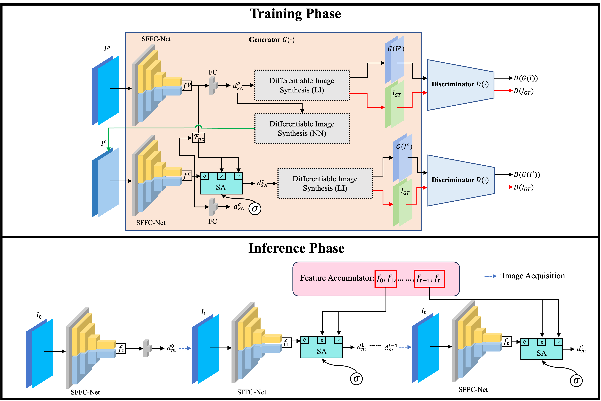

# GA-SA-RBF
Paper "Distance Regression Enhanced with Temporal Information Fusion and Adversarial Training for Robot-Assisted Endomicroscopy" gets accepted in IEEE-TMI.


## pCLE Regression Dataset 
The dataset is avaliable [[`here`](https://zenodo.org/records/7147878)].
## Training code
The root path of model's checkpoints and data folder should be modified in `options.py`.
For training:
```
bash train.sh
```

## Pre-trained Discriminator and Trained GA-SA-RBF

The pre-trained Discriminator and trained GA-SA-RBF model are available [here](https://drive.google.com/drive/folders/1LtWTjKgW7uorj2qvG_ZO3D5fFRTe-Ivx?usp=sharing).

Remember that the pretrained discriminator `D.pt` should be put in the `pre_trained` folder.


